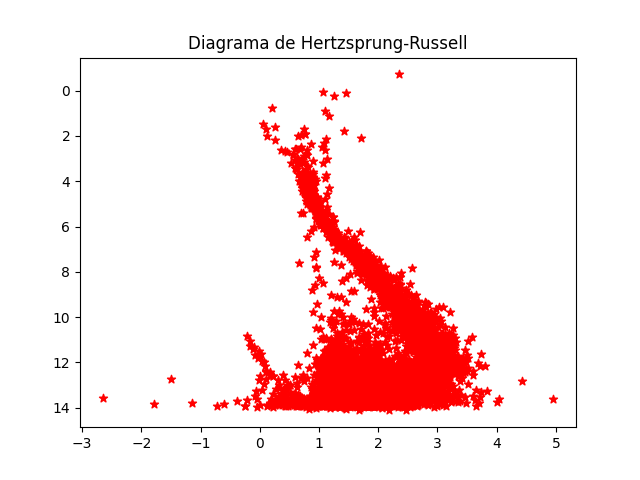

# Ciencia de Datos Abierta y Reproducible

Problema: Arqueología Galáctica: Construir el Diagrama de Hertzsprung-Russell (Color vs Magnitud Absoluta). Identificar la Secuencia Principal y las Gigantes Rojas

## Arquitectura del pipeline

El código cuenta con 3 scripts, `pipeline.sh` que se encarga de descargar los datos directamente desde la base de datos de GaiaDR3 en un csv y automatiza todo el proyecto; `constructor_db.py` se encarga de convertir el csv de gaia en un database local con el cual podemos trabajar; y finalmente `analisis_visual.py` que se encarga de tomar los datos del database y de aquí ajustarlos para la graficación. 

Para ejecutar el proyecto solo es necesario correr `./pipeline.sh`, esto descargará los datos, los ajustará y abrirá la gráfica del diagrama de HR obtenido en el visualizador de imágenes nativo del sistema.

## Resultados y Análisis

Para la realización del diagrama se realizaron 2 ajustes: 

* Se calculó la Magnitud absoluta haciendo uso de la siguiente fórmula:

$$M = m - 5 \log_{10}(d) + 5$$

Donde m es `Gmag`, la magnitud aparente presente en los datos de GaiaDR3

* Además, se hizo uso de `plt.gca().invert_yaxis()` para que la gráfica concordara con el diagrama de HR estándar.

El diagrama de Hertzsprung-Russell generado por el pipeline se muestra a continuación:

### Interpretación

El eje x representa el índice de color, y fue tomado directamente de la base de datos de Gaia, de la columna BP-RP. 

La estructura diagonal que se aprecia en el gráfico representa a la secuencia principal, que es donde se ubican la mayor parte de las estrellas aquí presentes.

Debido a que los datos con los que se trabajó solo incluyel paralajes superiores a 3, no hay magnitudes menores a 0 presentes en la gráfica, debido a esto no se pueden observar estrellas gigantes en el diagrama.

## Declaración de uso IAs.

Declaro que el código contenido en este notebook es de mi propia autoría y no ha sido obtenido usando exclusivamente grandes modelos de lenguaje (LLMs o IAs).

En casos excepcionales:

- Cualquier uso fue declarado en las celdas respectivas y en caso de que grandes porciones de código hayan sido extraídas de una IA, lo he indicado explícitamente agregando entre los comentarios el o los prompts utilizados.
